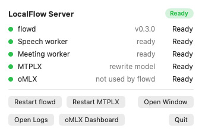
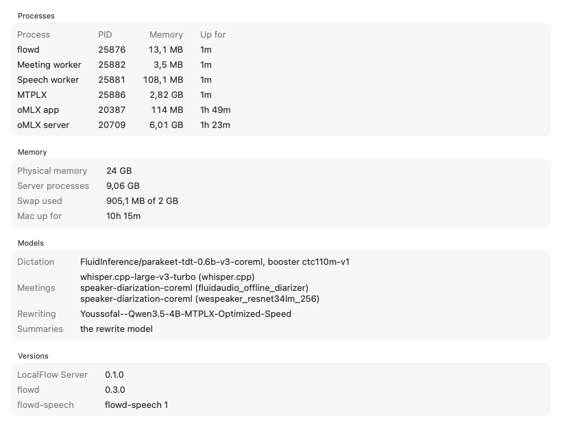
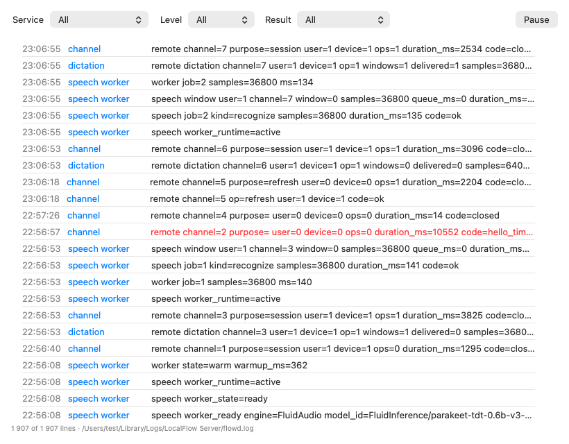
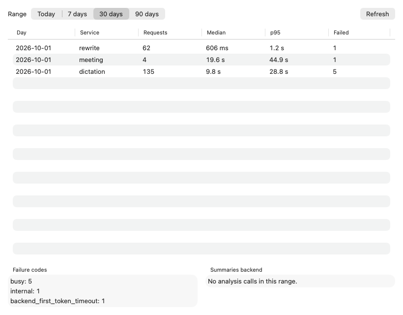
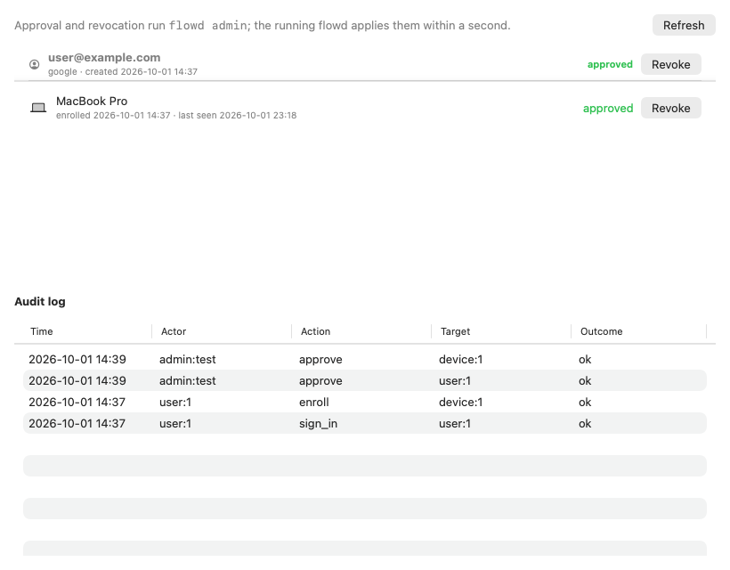
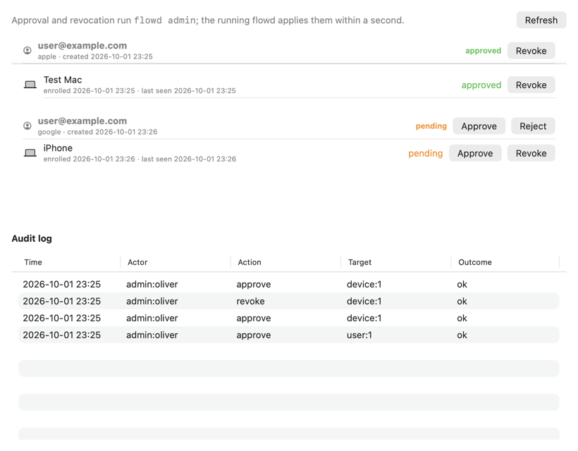
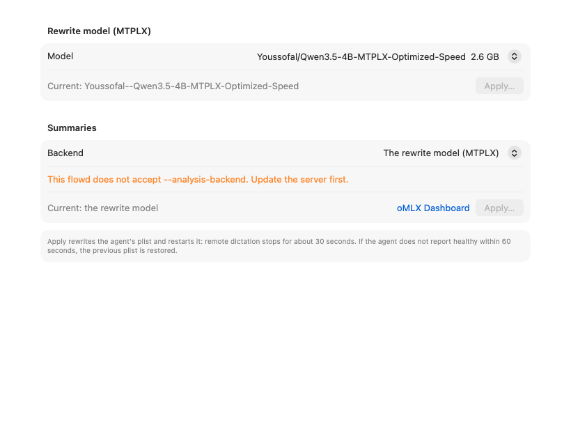
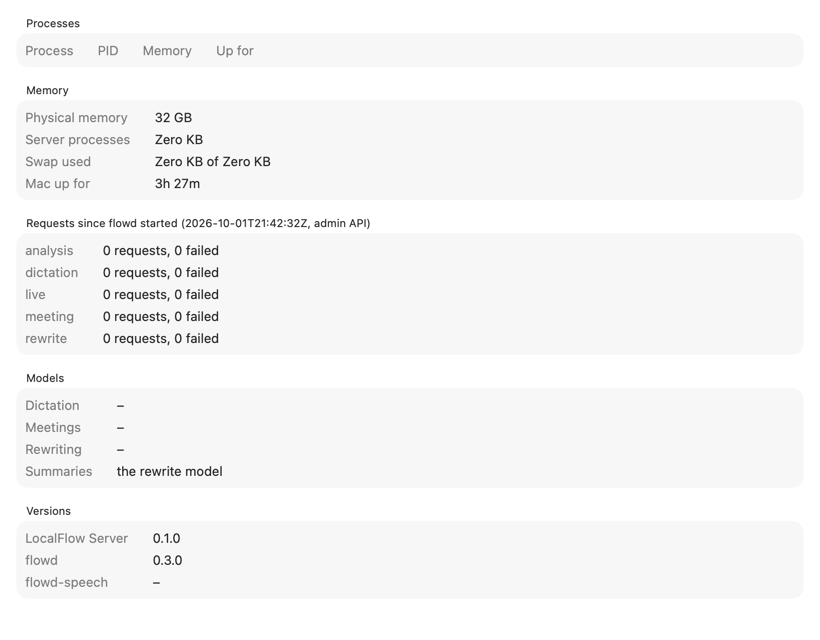

# LocalFlow Server: the menu bar app on the server Mac

LocalFlow Server (`apps/macos/LocalFlowServer`, target `LocalFlowServer`, bundle ID `org.localflow.LocalFlow.server`) is a second macOS app, recorded as an exception in [ADR 0032](../adr/0032-server-menu-bar-app.md). It runs on the Mac that runs the LocalFlow server, watches the two launch agents the installer creates (`org.localflow.LocalFlow.remote` for flowd, `.remote.mtplx` for the rewrite model) and manages them. flowd stays the server: the app loads no model, runs no inference and opens no listener. It shows only what flowd already logs, content-free `key=value` lines, and never shows or stores API keys or tokens.

## Install and update

The server Mac has only the Command Line Tools, so the app is built on a Mac with Xcode and copied over SSH:

```sh
scripts/install-server-app.sh mac-mini.tailf15b6.ts.net            # build Release, copy to /Applications, open
scripts/install-server-app.sh mac-mini.tailf15b6.ts.net --snapshot DIR   # also render the screenshots into DIR
```

The app is ad-hoc signed (`CODE_SIGN_IDENTITY = -`). No App ID or profile is registered on team 944A459UC3. To start it at login, add it under System Settings › General › Login Items on the server Mac.

## What it shows

**Menu bar.** One icon for the overall state (Ready, Loading or Down), counting flowd, the speech worker, the meeting worker, MTPLX and, while it serves summaries, oMLX. The panel lists each with its state and offers Restart flowd and Restart MTPLX (`launchctl kickstart -k`, after a warning that remote dictation stops for about 30 s), Open Window, Open Logs (Console) and the oMLX dashboard (`http://127.0.0.1:8443/admin`).



The states come from `launchctl print gui/<uid>/<label>`, `GET 127.0.0.1:8091/v1/rewrite/health` (flowd's version and MTPLX's `backend.state`), the last `speech worker_state=` line for each worker since flowd last logged `version=… listening=…` (the meeting worker's lines start with `flowd meeting`), and whether oMLX answers on 8443 at all (it answers 401 without its key).

**Overview.** Memory footprint (`proc_pid_rusage`) and uptime of flowd, both workers (children of flowd, told apart by their `serve`/`meeting` argument), MTPLX, the oMLX app and its server process; physical memory, swap (`vm.swapusage`); the model each service runs (from the workers' `worker_ready` lines and the plists); flowd and worker versions; and, when flowd runs with `--admin-listen`, the request counters since flowd started.



**Logs.** A live tail of `flowd.log` and `flowd.log.1`, newest first, at most 5,000 lines in memory, filtered by service, level and result code, with Pause and Copy Line (also Cmd-C). Lines that don't parse are shown raw.



**Stats.** Every minute, whether or not the window is open, the app reads what flowd logged since last time (by inode and offset, so it follows the 1 MiB rotation) into `~/Library/Application Support/org.localflow.LocalFlow.server/stats.sqlite` and drops rows older than 90 days. Each row is a day, a service, a duration, a result code and, for analysis backend calls, the model that answered. The tab shows requests per service per day with median and p95 duration, failures, the failure codes, and how many analysis calls the rewrite model answered while a separate summaries backend was set. A dictation's duration is the whole operation, speaking time included, not the wait after the key is released.



**Devices.** Users and devices from `flowd admin list`, the audit log from `flowd admin audit --limit 200`, and Approve, Reject and Revoke buttons that run `flowd admin approve|reject|revoke user|device <id>` with `Process` (absolute path, no shell). The app runs in the GUI session, where the login Keychain is unlocked, so these work without Screen Sharing. Only the transitions flowd allows are offered; reject and revoke ask first. Snapshots replace user names and emails with `user@example.com`.




**Models.** The rewrite model, picked from `mtplx models --json`, and the summaries backend: the rewrite model, or a model or profile oMLX lists at `/v1/models` (read with the key from `~/.omlx/settings.json`, kept in memory). Apply edits only `ProgramArguments` in the agent's plist, as `scripts/install-remote-server.sh` renders them, keeps the previous plist in `…/org.localflow.LocalFlow.server/plist-backups/`, restarts the agent with `bootout` and `bootstrap`, and restores the previous plist unless the agent reports healthy with a new PID twice within 60 s. Choosing oMLX can copy oMLX's key into `<data-dir>/analysis-api-key` (0600). A flowd that doesn't know `--analysis-backend` is detected with `flowd serve -h` and the switch is disabled. When flowd runs with `--admin-listen`, the summaries switch goes through the admin API instead, without a restart, and the plist is saved for the next start.



## flowd's admin API

`flowd serve --admin-listen 127.0.0.1:8093` (the installer adds it; 18093 for `--dev`) opens a third listener for this app:

- `GET /v1/admin/status`: version, start time, requests and failures per service since start (counted from flowd's own `remote <service> … code=` log lines), and the current summaries backend.
- `PUT /v1/admin/analysis` with `{"backend":"http://127.0.0.1:8443/v1","model":"smart"}` or `{"backend":""}`: switch summaries without a restart. Only loopback `http(s)` URLs are accepted; the key comes from `<data-dir>/analysis-api-key`.

Every request needs `Authorization: Bearer <token>` with the token from `<data-dir>/admin-token`, which flowd creates (0600) on first start and refuses if other users can read it. The listener must be a loopback IP literal, different from `--listen` and `--remote-listen`. The routes exist only on that listener: the main listener (8091) and the remote listener (8090, the one Tailscale Serve exposes) answer 404.



## How it was verified (2026-10-01)

- `make check` passed after every slice. It lints the app's sources with `swift format`, builds the `LocalFlowServer` scheme and runs its 34 XCTests: log line parsing (the meeting prefix, quoted and unquoted values with spaces, levels, raw lines), worker states across flowd restarts, `launchctl print` parsing, status derivation, log reading across rotation and partial lines, process arguments and the app's own footprint, the stats records, percentiles, incremental ingest across rotation, reopening and retention, `flowd admin list`/`audit` parsing with padded columns and spaces in names, the offered transitions, plist argument edits and the admin status JSON.
- Go tests for the admin API (`server/cmd/flowd/admin_api_test.go`): flag refusals, the 0600 token file, the counters, 401 without a token, 403 with a wrong one, 404 for the admin routes on the remote and main listeners, refusal of non-loopback and non-http backends, and a live switch to a second backend that `/v1/analysis/health` reports after the 5 s probe cache.
- Each tab was rendered on the Mac mini against the running server (`--snapshot`): all five services Ready; flowd, workers, MTPLX, oMLX app and server with their footprints; real log lines; 2026-10-01's stats (62 rewrites, median 606 ms, p95 1.2 s; 135 dictations; 4 meeting jobs; failure codes `busy`, `internal`, `backend_first_token_timeout`); the real users and audit log (redacted); the three MTPLX packs; and the "update the server first" note, because the mini runs flowd from 283ebe6, which predates `--analysis-backend`.
- `flowd admin approve|revoke|reject` with the app's argument lists, against a throwaway data directory: transitions applied and audited, and a refused one (`approved` → `rejected`) returned flowd's message with exit 3.
- Apply and rollback (`AgentChange`) against a throwaway launch agent on the MacBook running `/bin/sleep`: a good change applied with a new PID; a change to a missing binary was rolled back after the deadline and the previous plist restored. Not run against the mini's agents.
- The admin API against a locally built flowd: 401 without a token, the status JSON with the token, 404 on 8091, the token file 0600, and the Overview showing the counters.
- Measured once on the Mac mini (M5 Pro, 24 GB, macOS 27.0), Release build, window never opened, after 8 minutes: footprint 20 MB, RSS 88 MB, 0 % CPU at the sampled moment. Not measured with the window open or over a day.

## What's left

- The Mac mini still runs flowd from 283ebe6. Its Models tab shows the summaries switch as unavailable and there is no admin API until the server is updated (`git pull` in `~/local-flow` after a push, then the installer with `--speech-worker` and `--meeting-helper` pointing at the installed copies; this restarts both agents).
- Restart flowd/MTPLX, Apply in Models and the device buttons were not clicked on the mini; each was exercised through the same code path as described above.
- Two log rotations between reads (more than 1 MiB of log within a minute) lose the middle file's stats.
- The admin API counts from log lines; if a `remote <service>` line changes shape, the counters and the Stats tab miss it together.
- With no summaries backend set, flowd now gates each analysis backend call instead of each analysis request (the same per-call gate it already used for fallback calls to the rewrite model).
- Only the production variant (`org.localflow.LocalFlow.remote`) is watched; the `--dev` variant is not.
- The app is ad-hoc signed; a Developer ID or team signature needs an App ID on 944A459UC3, which needs the owner's approval.
